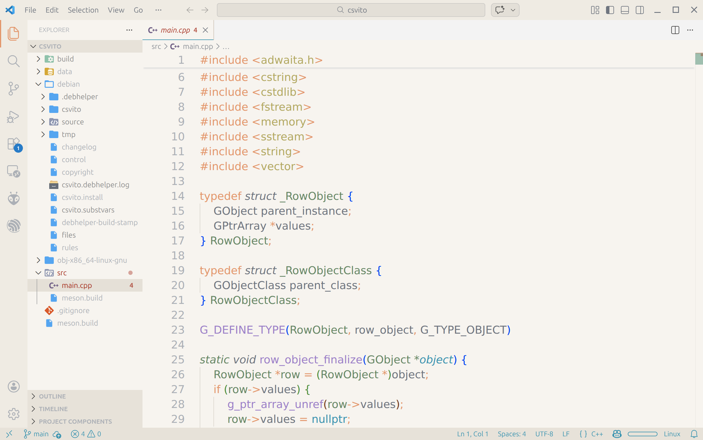

# Gunacode

A theme for VS Code inspired by Guna ([https://github.com/poucotm/Guna](https://github.com/poucotm/Guna))

This extension includes two variants:
- Gunacode Dark
- Gunacode Light

Gunacode Dark:

Gunacode Light:

## Installation
Install from the VS Code Extensions Marketplace.
